  

<h1 align="center" style="font-family: 'Arial Black', sans-serif">
  
</h1>

<h3>:file_folder: My Git Repositories</h3>

  Check out
  <a href="https://github.com/SushankSharma?tab=repositories">here</a> for a
  collection of my Git repositories. Feel free to explore!

<h3>GitHub Contributions</h3>

<!--🐍💬SNAKETITLE / 🌐WEBSITE: https://textanim.com/ -->

<!--🐍📈SNAKEGRAPH / 🌐WEBSITE: https://github.com/Platane/snk -->

<a href="https://github.com/SushankSharma">
  
 
  <!--  -->
</a>

 

<h2 align="left" style="font-family: 'Verdana', sans-serif">🚀 Skills:</h2>

  
  
  
  
  
  
  

<h2 align="left" style="font-family: 'Verdana', sans-serif">
  📈 GitHub Stats:
</h2>

  

<h2 align="center" style="font-family: 'Verdana', sans-serif">
  🔗 Let's Connect:
</h2>

  
  &nbsp;•&nbsp;
  
  &nbsp;•&nbsp;
  
  &nbsp;•&nbsp;
  

 

  <a href="#">
    <picture>
      <source media="(prefers-color-scheme: light)" srcset="text/dark.svg" />
      <source media="(prefers-color-scheme: dark)" srcset="text/light.svg" />
      
    </picture>
  </a>

<!-- 

  

 -->

<!-- 

  

 -->

<!-- 

  

 -->

<!-- 

  

 -->

<!-- 

  
  
  

 -->
